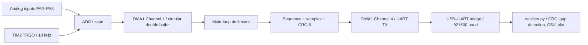

# Acquisition architecture

The host treats sequence gaps as observable backpressure rather than silently
accepting missing data. Firmware also counts frames dropped while UART DMA is
busy or cannot start. Measurements from a logic analyzer are still required to
claim real 10 kHz timing and jitter performance.
